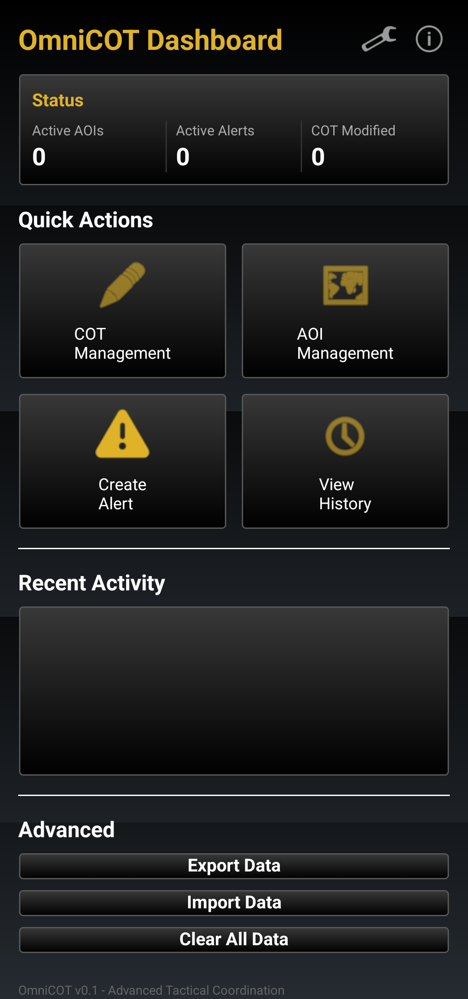

# OmniCOT

An advanced ATAK plugin for tactical coordination and situational awareness.

## Overview

OmniCOT provides tactical teams with enhanced capabilities for managing Cursor on Target (CoT) markers, Areas of Interest (AOI), and geofence-based alerting within the ATAK ecosystem.

### Features

- **Modern Dashboard Interface**: Card-based UI displaying real-time operational metrics
- **CoT Management**: Modify marker affiliations and battle dimensions
- **AOI Detection**: Automatic detection and management of areas of interest
- **Alert Foundation**: Infrastructure for geofence-based notification system
- **Activity Tracking**: Monitor recent plugin operations

## Screenshots

### Dashboard



The plugin features a modern dashboard with:
- Status metrics showing active AOIs, alerts, and CoT modifications
- Quick action cards for common operations
- Recent activity feed
- Advanced data management controls

## Requirements

- ATAK-CIV 5.5.0 or later
- Android SDK 21+ (Android 5.0 Lollipop)
- Target SDK 34

## Installation

### From Release

1. Download the latest APK from [Releases](../../releases)
2. Install via ADB:
   ```bash
   adb install -r ATAK-Plugin-omnicot-0.1--5.5.0-civ-debug.apk
   ```
3. Restart ATAK
4. The OmniCOT button will appear in the toolbar

### Building from Source

See [CONTRIBUTING.md](CONTRIBUTING.md) for build instructions.

## Usage

### Accessing the Dashboard

Tap the OmniCOT toolbar button to open the dashboard interface.

### Modifying CoT Markers

1. Select "COT Management" from the dashboard
2. Tap a marker on the map
3. Choose new affiliation (Friend/Neutral/Hostile/Unknown)
4. Select battle dimension (Point/Air/Ground/Sea/Subsurface)
5. Confirm to federate changes

### Managing Areas of Interest

1. Create shapes using ATAK's drawing tools
2. Select "AOI Management" from the dashboard
3. View detected areas and configure alerts

## Architecture

OmniCOT follows standard ATAK plugin patterns:

```
PluginTemplate (AbstractPlugin)
├── OmniCOTTool (Toolbar Integration)
├── OmniCOTMapComponent (Lifecycle Management)
├── OmniCOTDropDownReceiver (UI Controller)
└── DashboardActivity (Statistics & UI State)
```

## Technical Details

### Intent Actions

- `com.engindearing.omnicot.SHOW_PLUGIN`: Displays the dashboard

### Dependencies

- AndroidX RecyclerView 1.3.2
- AndroidX Annotation 1.8.2

### Supported Architectures

- armeabi-v7a
- arm64-v8a
- x86 (debug builds only)

## Contributing

Contributions are welcome! Please see [CONTRIBUTING.md](CONTRIBUTING.md) for:
- Development setup instructions
- Code style guidelines
- Pull request process
- Testing requirements

## Roadmap

Future enhancements planned:

- [ ] Geofence monitoring with entry/exit notifications
- [ ] Alert creation and configuration UI
- [ ] Export/import functionality for AOIs
- [ ] Historical activity logging with persistence
- [ ] Integration with ATAK notification system
- [ ] Multi-marker batch operations

## License

This project is licensed under the MIT License - see the [LICENSE](LICENSE) file for details.

## Contact

- Project Maintainer: Engindearing
- Issues: [GitHub Issues](../../issues)
- Email: j@engindearing.soy

## Acknowledgments

Built using the ATAK-CIV SDK. ATAK is a product of the Air Force Research Laboratory.

## Disclaimer

This plugin is provided as-is for use with ATAK-CIV. It is not officially endorsed or supported by the ATAK development team.
