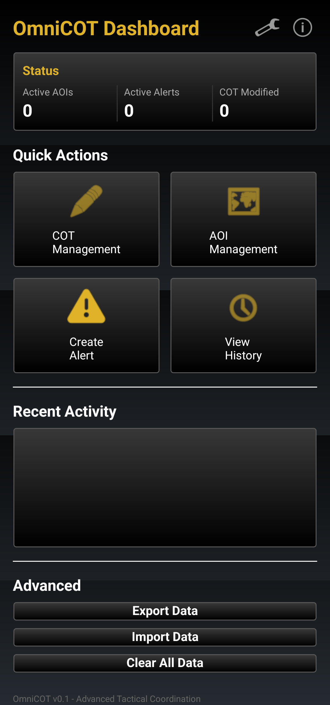
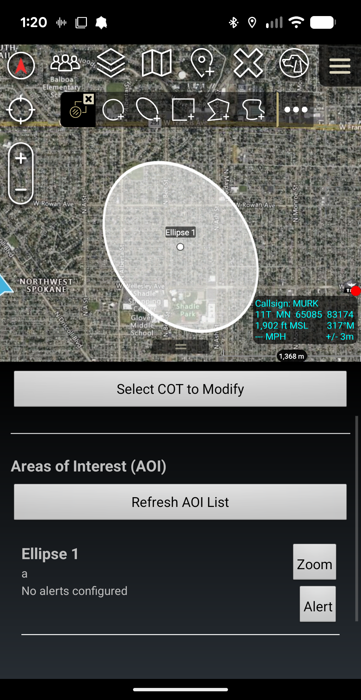
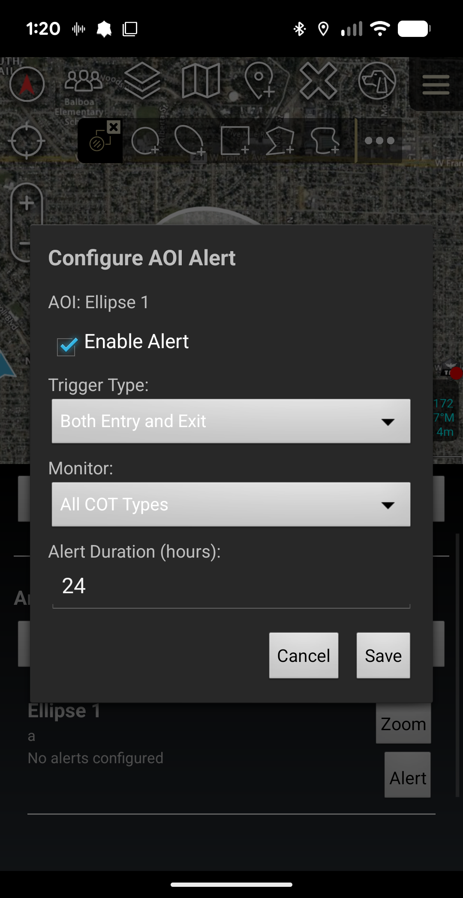

# OmniCOT

An advanced ATAK plugin for tactical coordination and situational awareness.

## Overview

OmniCOT provides tactical teams with enhanced capabilities for managing Cursor on Target (CoT) markers, Areas of Interest (AOI), and geofence-based alerting within the ATAK ecosystem.

### Features

- **Modern Dashboard Interface**: Card-based UI displaying real-time operational metrics
- **CoT Management**: Modify marker affiliations and battle dimensions
- **AOI Detection**: Automatic detection and management of areas of interest
- **Alert System**: Geofence-based alerting for CoT entry/exit events (Alpha)
- **Activity Tracking**: Monitor recent plugin operations

## Screenshots

### Dashboard



The plugin features a modern dashboard with:
- Status metrics showing active AOIs, alerts, and CoT modifications
- Quick action cards for common operations
- Recent activity feed
- Advanced data management controls

### Alert System



Area of Interest (AOI) detection and management:
- Automatic detection of drawn shapes on the map
- List view of all detected AOIs
- Quick access to zoom and alert configuration
- Real-time status of configured alerts



Alert configuration interface:
- Enable/disable alerts for specific AOIs
- Configure trigger types (Entry, Exit, or Both)
- Monitor specific COT types or all markers
- Set alert duration in hours
- Simple save/cancel workflow

## Requirements

- ATAK-CIV (see version matrix below for the right plugin build)
- Android SDK 21+ (Android 5.0 Lollipop)

## Installation

Pick the plugin build that matches your installed ATAK version:

| Your ATAK version | Plugin release |
|---|---|
| 5.7.x | [v0.7-5.7](../../releases/tag/v0.7-5.7) |
| 5.6.x | [v0.7-5.6](../../releases/tag/v0.7-5.6) |
| 5.4.x – 5.5.x | [v0.6](../../releases/tag/v0.6) |

The ATAK 5.6 build env changed substantially (new takdev plugin, AGP 8.13, compileSdk 36), so a single APK cannot span the pre-5.6 and post-5.6 range. v0.7 ships as **two separate signed APKs** built from the same source against ATAK 5.6 and 5.7 respectively.

### Install steps

1. Download the APK for your ATAK version from the table above
2. Side-load on the device — tap the APK and allow install from this source, or:
   ```bash
   adb install -r ATAK-Plugin-omnicot-0.7--5.7.0-civ-release.apk
   ```
3. Open ATAK → Settings → Tool Preferences → Plugins → enable **OmniCOT**

The v0.7 builds are signed by the TAK Product Center Third Party Pipeline (TPP). ATAK will show a "third-party signed" badge in the plugin manager — that's expected for community-signed plugins.

### Building from Source

See [CONTRIBUTING.md](CONTRIBUTING.md) for build instructions.

### TAK.gov Pipeline Submission

`make-pipeline-zip.sh` creates source archives for TPP submission:

```bash
./make-pipeline-zip.sh
```

**Output (current state):**
- `omnicot-pipeline-atak5.6.0-{timestamp}.zip` — for ATAK 5.6
- `omnicot-pipeline-atak5.7.0-{timestamp}.zip` — for ATAK 5.7

Each zip contains:
- Source code with `ATAK_VERSION` set for the target version
- Build configuration (Gradle 8.14.3, AGP 8.13.0, takdev 3.+)
- All resources and documentation
- Excludes credentials (local.properties) and build artifacts

**Upload to TPP:**
1. Go to https://tpp.tak.gov
2. Upload each zip to the corresponding ATAK version pipeline
3. Wait for TPP to build, security-scan, and sign (~5–10 minutes per version)
4. Drop the returned signed APK into a new `releases/v<ver>/` directory and tag a GitHub release

## Usage

### Accessing the Dashboard

Tap the OmniCOT toolbar button to open the dashboard interface.

### Modifying CoT Markers

1. Select "COT Management" from the dashboard
2. Tap a marker on the map
3. Choose new affiliation (Friend/Neutral/Hostile/Unknown)
4. Select battle dimension (Point/Air/Ground/Sea/Subsurface)
5. Confirm to federate changes

### Managing Areas of Interest

1. Create shapes using ATAK's drawing tools
2. Select "AOI Management" from the dashboard
3. View detected areas and configure alerts

## Integration with OmniTAK

**OmniTAK** is a companion server application that aggregates CoT messages from multiple TAK servers, providing:
- REST API for programmatic access to tactical data
- Web dashboard for monitoring all connected ATAK devices
- Advanced filtering and routing of CoT messages
- Real-time metrics and monitoring

**Use Together**: Run OmniCOT on ATAK devices in the field, and OmniTAK on a server to aggregate and analyze all tactical data in real-time.

### Getting Started with OmniTAK

1. **Clone OmniTAK**:
   ```bash
   git clone https://github.com/engindearing-projects/omni-TAK
   cd omni-TAK
   ```

2. **Extract Certificates from ATAK** (device running OmniCOT):
   ```bash
   # Connect ATAK device via USB
   ./scripts/setup-tak-connection.sh --adb
   ```

3. **Start OmniTAK**:
   ```bash
   cargo run --release -- --config config/config.yaml --admin-password your_password
   ```

4. **Access Web UI**: http://localhost:9443

### Complete Integration Guide

See **[OmniTAK Integration Guide](docs/OMNITAK_INTEGRATION.md)** for detailed instructions on:
- Setting up OmniTAK to connect to your TAK servers
- Extracting and configuring certificates
- Filtering CoT messages by affiliation
- Using the REST API to access tactical data
- Multiple TAK server configurations
- Monitoring and metrics

**Resources**:
- [OmniTAK Repository](https://github.com/engindearing-projects/omni-TAK)
- [OmniTAK Setup Guide](https://github.com/engindearing-projects/omni-TAK/blob/main/docs/TAK_SERVER_SETUP.md)
- [Integration Guide](docs/OMNITAK_INTEGRATION.md) (in this repository)

## Architecture

OmniCOT follows standard ATAK plugin patterns:

```
PluginTemplate (AbstractPlugin)
├── OmniCOTTool (Toolbar Integration)
├── OmniCOTMapComponent (Lifecycle Management)
├── OmniCOTDropDownReceiver (UI Controller)
└── DashboardActivity (Statistics & UI State)
```

## Technical Details

### Intent Actions

- `com.engindearing.omnicot.SHOW_PLUGIN`: Displays the dashboard

### Dependencies

- AndroidX RecyclerView 1.3.2
- AndroidX Annotation 1.8.2

### Supported Architectures

- armeabi-v7a
- arm64-v8a
- x86 (debug builds only)

## Contributing

Contributions are welcome! Please see [CONTRIBUTING.md](CONTRIBUTING.md) for:
- Development setup instructions
- Code style guidelines
- Pull request process
- Testing requirements

## Roadmap

Future enhancements planned:

- [ ] Geofence monitoring with entry/exit notifications
- [ ] Alert creation and configuration UI
- [ ] Export/import functionality for AOIs
- [ ] Historical activity logging with persistence
- [ ] Integration with ATAK notification system
- [ ] Multi-marker batch operations

## License

This project is licensed under the MIT License - see the [LICENSE](LICENSE) file for details.

## Contact

- Project Maintainer: Engindearing
- Issues: [GitHub Issues](../../issues)
- Email: j@engindearing.soy

## Acknowledgments

Built using the ATAK-CIV SDK. ATAK is a product of the Air Force Research Laboratory.

## Disclaimer

This plugin is provided as-is for use with ATAK-CIV. It is not officially endorsed or supported by the ATAK development team.
